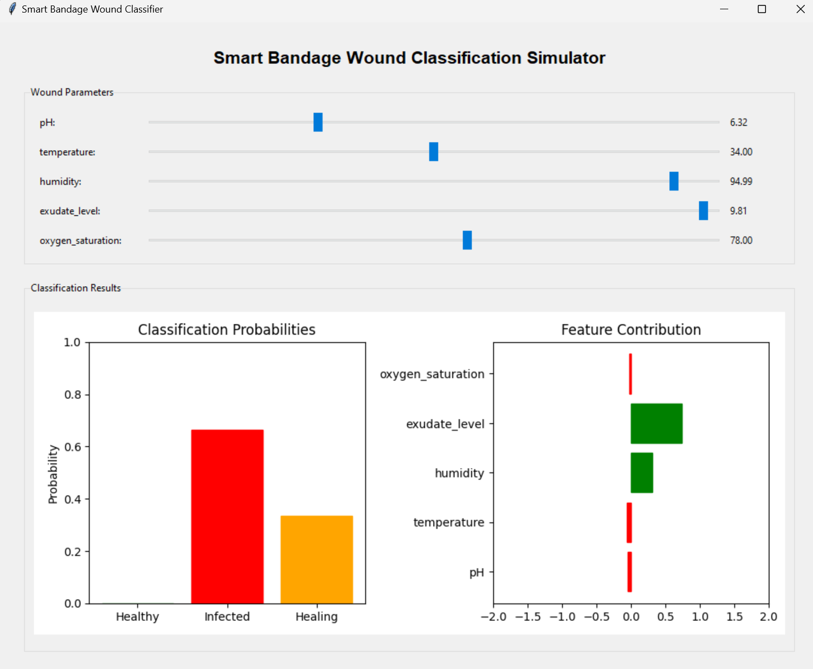
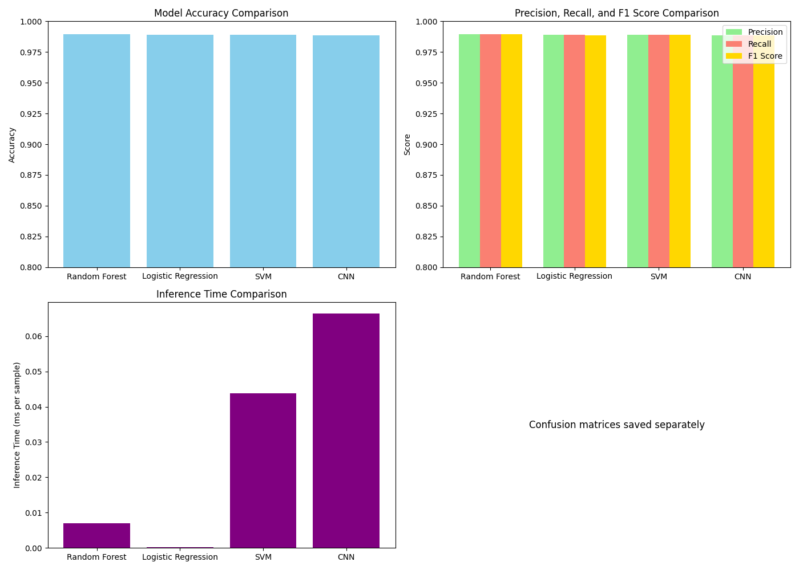

# 🩹 Smart Bandage: TinyML-Powered Wound Monitoring System

[](https://www.tinyml.org/)
[](research_paper/smart_bandage_research_paper.pdf)
[](LICENSE)

<div align="center">
  
  <p><em>Smart Bandage Monitoring Interface showing real-time wound status classification</em></p>
</div>

## 📋 Overview

This research project presents a novel smart bandage system utilizing TinyML (Tiny Machine Learning) to enable continuous, non-invasive wound monitoring. The system uses miniaturized sensors to collect key physiological parameters (pH, temperature, humidity, exudate level, and oxygen saturation) and employs on-device machine learning to classify wound conditions as healthy, infected, or healing in real-time.

<div align="center">
  
  <p><em>Performance comparison of different ML models evaluated for the smart bandage system</em></p>
</div>

## ✨ Key Features

- **🔄 Real-time Wound Classification**: Continuous monitoring and classification of wound conditions
- **📊 Multi-modal Sensing**: Five complementary sensor modalities for comprehensive wound assessment
- **⚡ Ultra-efficient ML**: Optimized machine learning models for resource-constrained environments
- **🔋 Low Power Operation**: Designed for extended battery life in wearable applications
- **🏥 Clinical Relevance**: Developed with medical literature and clinical guidelines as foundation

## 🔬 Research Highlights

- **High Accuracy**: Achieves outstanding classification accuracy (98.9%) with minimal computational requirements
- **Model Optimization**: Comparative analysis of various ML models reveals Logistic Regression as optimal for TinyML deployment
- **Resource Efficiency**: Model requires only 2.1 KB of program memory and 1.4 KB of SRAM on an Arduino Nano 33 BLE Sense
- **Inference Speed**: Ultra-fast inference time of 0.0002 ms per sample enables real-time monitoring

## 📁 Repository Structure

```
smart-bandage-tinyml/
├── ml_models_comparison/         # ML model evaluation and comparison
│   ├── compare_ml_models.py      # Script for comparing ML models
│   └── results/                  # Performance metrics and visualizations
├── data/                         # Dataset files
│   ├── wound_data_train_*.csv    # Training dataset
│   └── wound_data_test_*.csv     # Testing dataset
├── research_paper/               # LaTeX research paper
│   ├── smart_bandage_research_paper.tex  # Main LaTeX document
│   └── figures/                  # Figures for the paper
├── models/                       # Trained models
│   └── logistic_regression.pkl   # Optimized Logistic Regression model
└── src/                          # Source code
    └── data_preprocessing.py     # Data preprocessing utilities
```

## 📊 Results

The comparative analysis of machine learning models for the smart bandage system:

| Model | Accuracy (%) | F1 Score | Inference Time (ms) | Training Time (s) |
|-------|--------------|----------|---------------------|-------------------|
| Random Forest | 98.94 | 0.9894 | 0.0070 | 32.52 |
| **Logistic Regression** | **98.88** | **0.9888** | **0.0002** | **0.25** |
| SVM | 98.88 | 0.9888 | 0.0438 | 5.99 |
| Neural Network | 98.84 | 0.9884 | 0.0663 | 34.70 |

<div align="center">
  
  <p><em>Confusion matrix for the Logistic Regression model</em></p>
</div>

## 🌟 Applications

- **Battlefield Medicine**: Early infection detection for injured soldiers
- **Chronic Wound Management**: Continuous monitoring without frequent dressing changes
- **Disaster Response**: Mass casualty management with limited medical personnel
- **Remote Healthcare**: Telemedicine support for patients in remote locations

## 🛠️ Technology Stack

- **Machine Learning**: scikit-learn, TensorFlow Lite
- **Data Processing**: Python, NumPy, Pandas
- **Visualization**: Matplotlib, Seaborn
- **Hardware**: Arduino Nano 33 BLE Sense (reference platform)
- **Documentation**: LaTeX, IEEE format

## 📝 Research Paper

This repository includes a complete research paper in IEEE format detailing our approach, methods, and findings. The paper discusses:

- System architecture and sensing capabilities
- Dataset generation and preprocessing
- Machine learning model selection and optimization
- Performance evaluation and results
- Applications in healthcare and battlefield medicine

## 👥 Authors

- **Yuvraj Singh** - Department of Computer Science and Engineering, NSUT Delhi - yuvraj_singh.ug21@nsut.ac.in
- **Vineet Verma** - Department of Computer Science and Engineering, NSUT Delhi - vineet.verma.ug21@nsut.ac.in
- **Sumeet Kant** - Department of Computer Science and Engineering, NSUT Delhi - sumeet.kant.ug21@nsut.ac.in
- **Aditya Dhingra** - Department of Computer Science and Engineering, NSUT Delhi - aditya.dhingra.ug21@nsut.ac.in

## 🔄 Getting Started

### Prerequisites

- Python 3.7+
- scikit-learn
- TensorFlow 2.x
- NumPy & Pandas
- Matplotlib & Seaborn

### Installation

```bash
# Clone the repository
git clone https://github.com/yourusername/smart-bandage-tinyml.git
cd smart-bandage-tinyml

# Install dependencies
pip install -r requirements.txt

# Run the model comparison
python ml_models_comparison/compare_ml_models.py
```

### Building the Research Paper

```bash
cd research_paper
pdflatex smart_bandage_research_paper.tex
bibtex smart_bandage_research_paper
pdflatex smart_bandage_research_paper.tex
pdflatex smart_bandage_research_paper.tex
```

## 🔗 Related Work

This project builds upon previous research in smart bandages and TinyML:

- Mehmood et al. (2015) - Flexible low power sensing for wound diagnostics
- Farooqui and Shamim (2016) - Low cost inkjet printed smart bandage
- Warden and Situnayake (2019) - TinyML on microcontrollers

## 📜 License

This project is licensed under the MIT License - see the [LICENSE](LICENSE) file for details.

## 🤝 Contributing

Contributions are welcome! Please feel free to submit a Pull Request.

1. Fork the repository
2. Create your feature branch (`git checkout -b feature/AmazingFeature`)
3. Commit your changes (`git commit -m 'Add some AmazingFeature'`)
4. Push to the branch (`git push origin feature/AmazingFeature`)
5. Open a Pull Request

## 📧 Contact

For questions or comments about this project, please contact the authors or open an issue on GitHub.

---

<div align="center">
  <p>Built with 💙💖💗💜🖤 </p>
  <p>Department of Computer Science and Engineering, Netaji Subhas University of Technology, Delhi, India</p>
</div>
